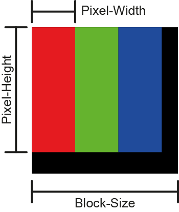

# RGB-Matrix Render a display RGB matrix from a source image.

 <h3>Dependency:</h3>

Pillow - <a href="https://pillow.readthedocs.io/en/stable/">https://pillow.readthedocs.io/en/stable/</a>

 <h3>Usage:</h3>
<pre>RGB-Matrix.py [-h] [-f] [-w] [-H] [-b]</pre>
<pre>positional arguments:
Filename of Source-Image
 
optional arguments:
-f , --format   Export File-Format (.jpg or .png)
-w , --width    Width of each Individual Pixel (R-G-B).
-H , --height   Height of each individual Pixel (R-G-B).
-b , --block    Block-Size defines the overall size of the repeated Pixel-Pattern.</pre>
 

 

If you execute the script without optional arguments, these settings are used:

<pre>-w 2 -H 5 -b 7 -f .jpg</pre>

Supported file formats for source image: .bmp, .jpeg, .jpg, .png, .tiff, .tif, .webp
 
 <h3>Tips:</h3>
<ul><li>Two output formats are supported (.jpg & .png). Choosing png as output file format results in a pretty clean matrix, while the compression for .jpg as output file format results in a way more realistic, organic look.</li><li>A pretty low resolution is recommended for the source image. The effect is way more visibl that way.</li></ul>
