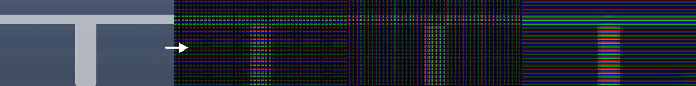

<h3># RGB-Matrix</h3>
Render a display RGB matrix from a source image.

 <h3>Dependency:</h3>

Pillow - <a href="https://pillow.readthedocs.io/en/stable/">https://pillow.readthedocs.io/en/stable/</a>

 <h3>Usage:</h3>
<pre>RGB-Matrix.py [-h] [-w] [-H] [-b] [-B] [-rw] [-rh]</pre>
<pre>positional arguments:
Filename of a single source-image, or directory for batch processing.
 
optional arguments:
-h , --help     show help message and exit 
-w , --width    Width of each individual Pixel (R-G-B).
-H , --height   Height of each individual Pixel (R-G-B).
-b , --block    Block-Size defines the overall size of the repeated Pixel-Pattern
-B , --black    Shift brightness of black pixels to simulate backlight shining; 0 = black 100 = white
-rw , --resizeWidth     Resize width of source image.
-rh , --resizeHeight    Resize height of source image.</pre>
 

 

If you execute the script without optional arguments, these settings are used:

<pre>-w 1 -H 3 -b 4 -B 0</pre>

Supported file formats for source image: .bmp, .jpeg, .jpg, .png, .tiff, .tif, .webp
 
 <h3>Tips:</h3>
<ul><li>Output resolution = Input resolution * Block Size!</li><li>A pretty low resolution is recommended for the source image. The effect is more visible that way.</li></ul>
